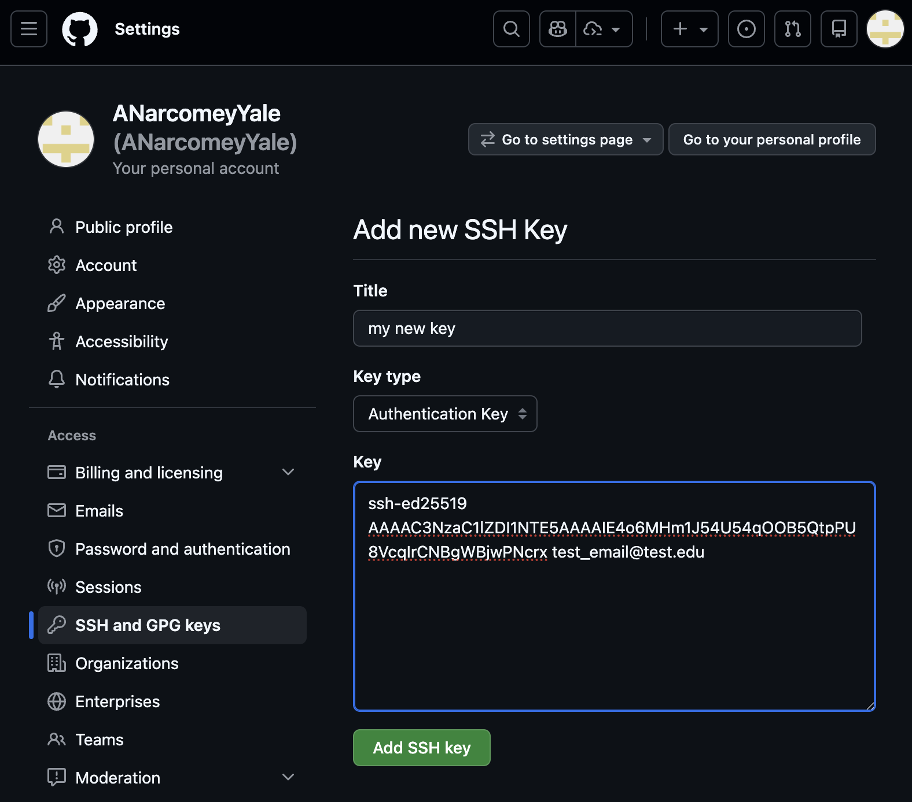
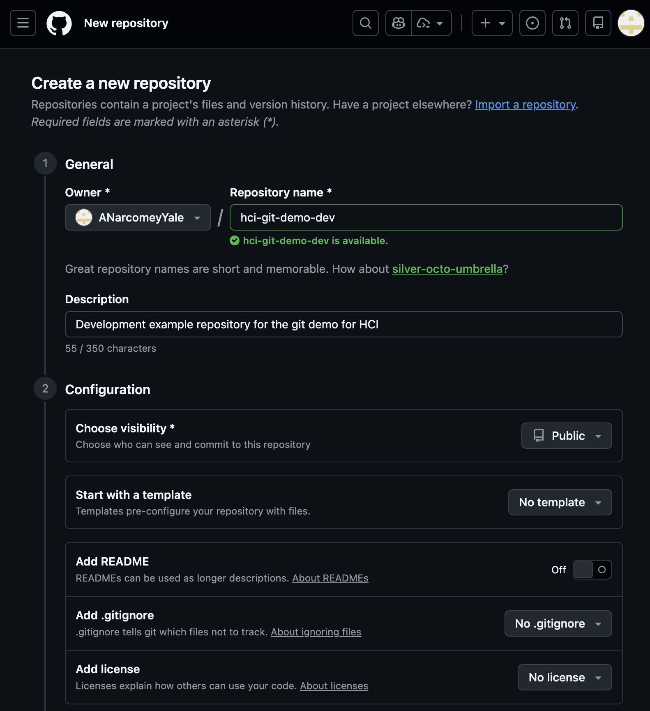
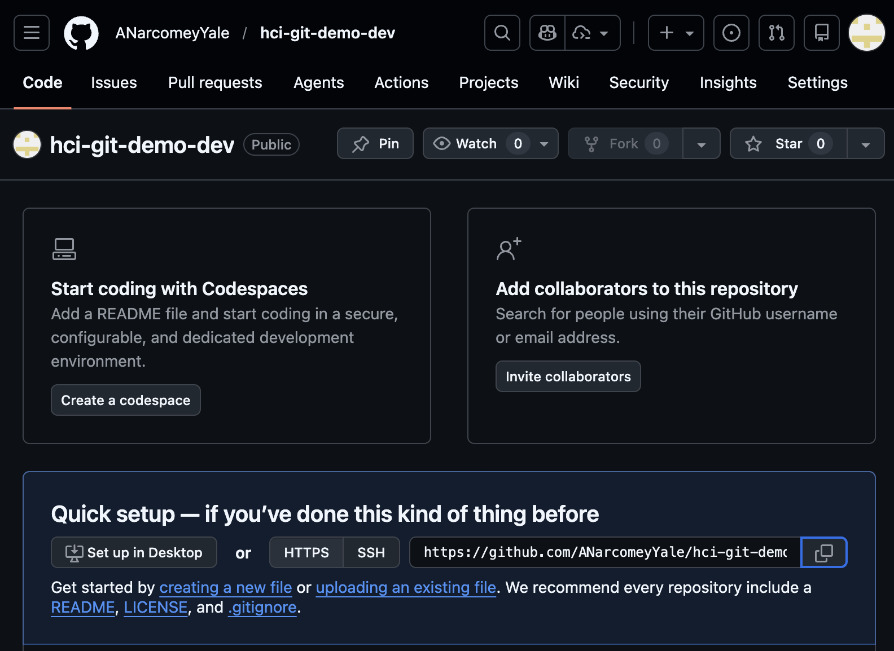
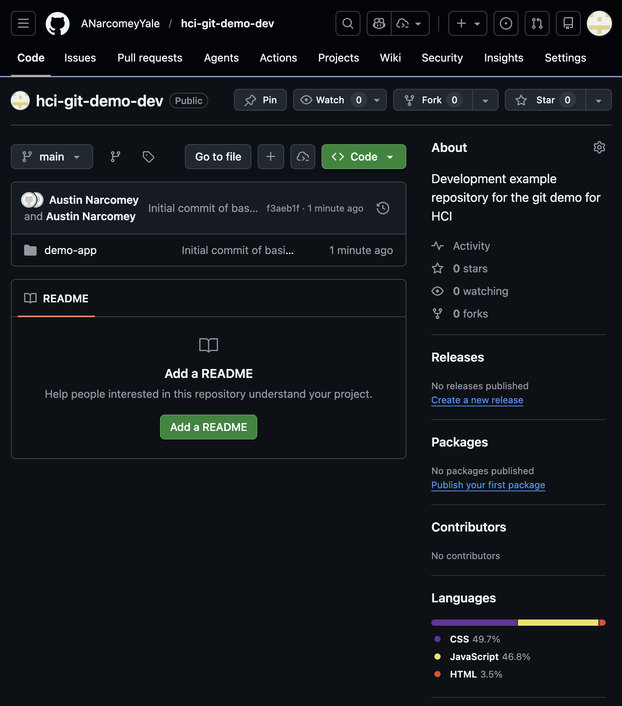
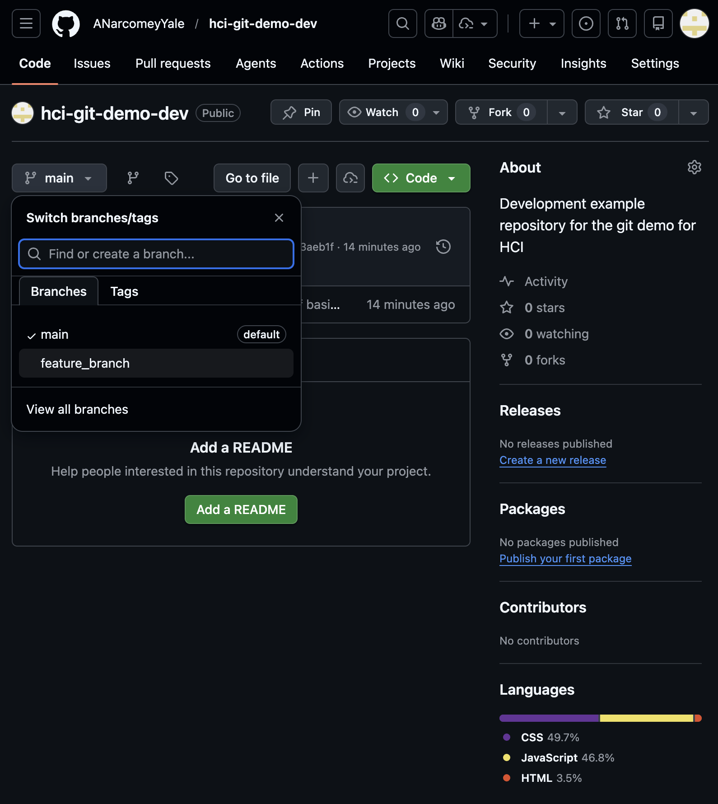
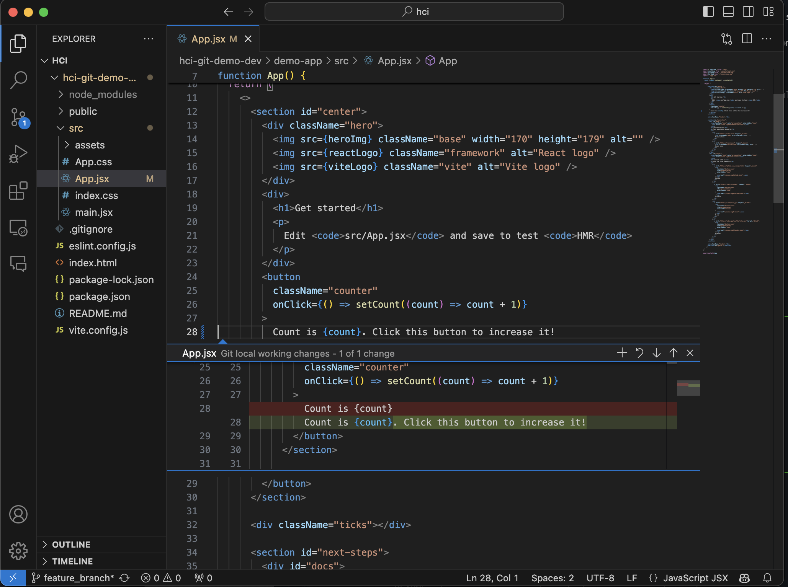
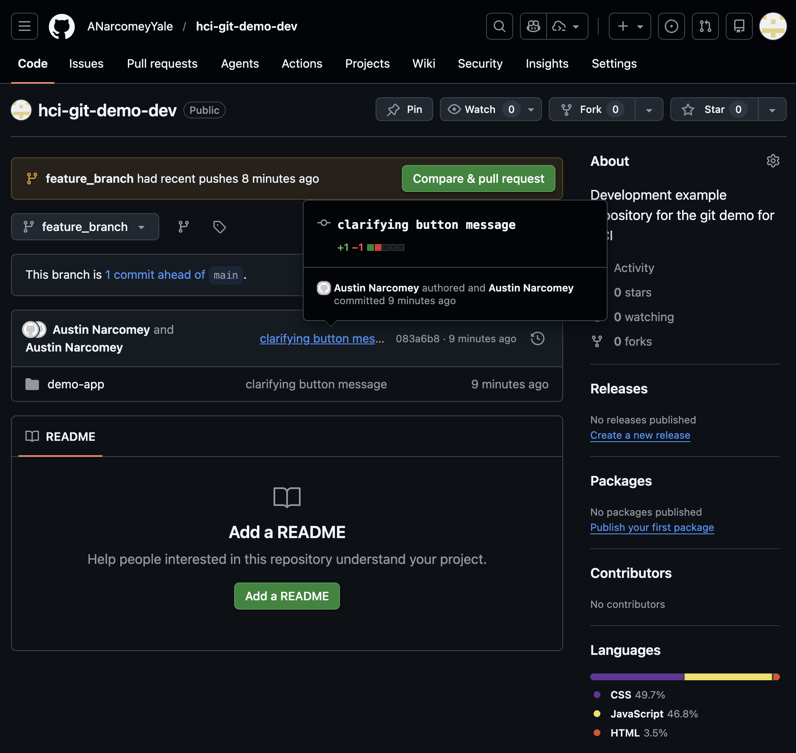
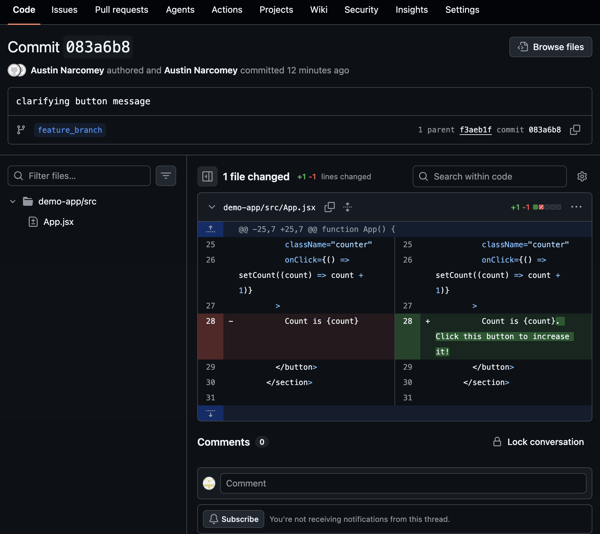
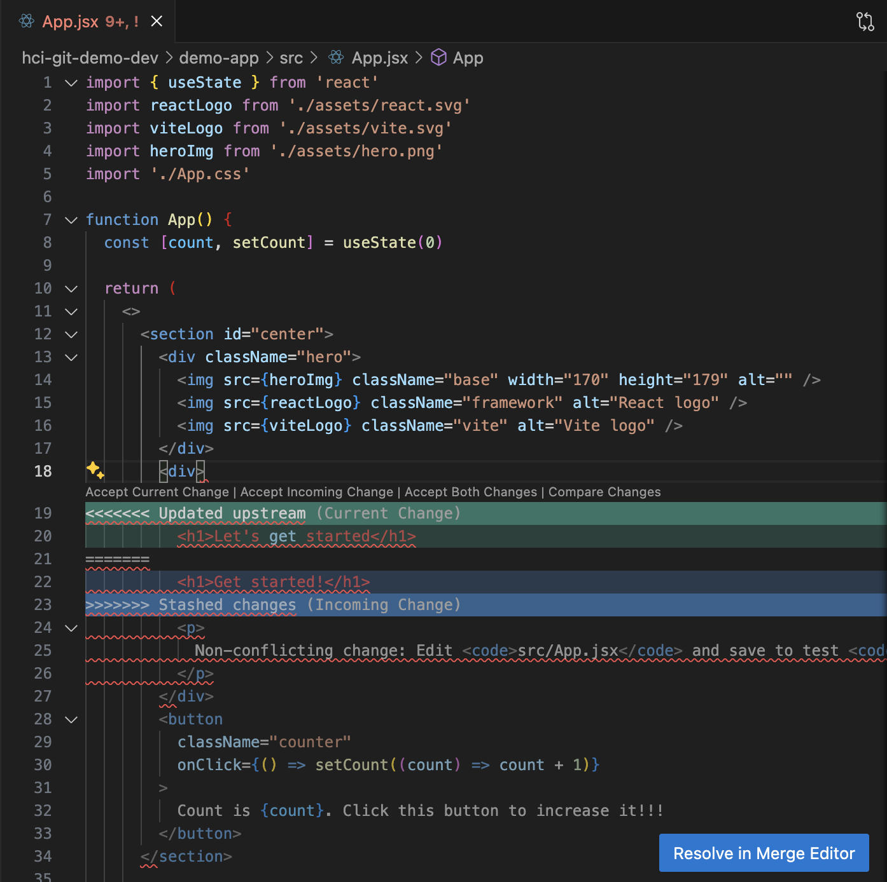

# Git Tutorial

## Setup

1. Set up an SSH key to authenticate GitHub operations on your machine:
   1. Generate the key pair locally:
      1. If you already have an ssh key pair in `~/.ssh`, skip to "Copy the public key"
      2. Otherwise, `ssh-keygen -t ed25519 -C "<email_address>"`. 
         1. If you would like to change the default name, enter absolute path: `/Users/<localmachine_user_name>/.ssh/id_ed25519_custom_name`
         2. Hit enter through all remaining prompts
   2. Copy the public key (`~/.ssh/id_ed25519.pub`):
      1. on macOS, `pbcopy < ~/.ssh/id_ed25519.pub`
      2. or more universally, `cat ~/.ssh/id_ed25519.pub` and copy manually
   3. Add the key to GitHub:
      1. Open profile settings: Click profile icon in top right --> `Settings` (or `github.com/settings/profile`)
      2. Open key settings: Click `SSH and GPG Keys` on left (or `github.com/settings/keys`)
      3. Click "New SSH Key" button in green box
      4. Give it a title and paste in the public key
      5. Click `Add SSH key` in green box:
      6. Test the ssh key: `ssh -T git@github.com`. It should say "Hi <user_name>! You've successfully authenticated ..."
2. Create a new repository:
   1. Visit `GitHub.com` and log in
   2. Menu in top left --> Click`Repositories` (or `GitHub.com/repos`)
   3. Click `New Repository` in green box (or `GitHub.com/new`)
   4. Specify the name of the repository, leave default settings, and click `Create Repository` in bottom right green box:
3. Clone the repository locally:
   1. Open your repository on GitHub: `github.com/<user_name>/<repo_name>`
   2. Select `SSH` to configure a link to clone the repo and copy. `SSH` allows passwordless authentication that you only have to set up once:
   3. In a shell, execute: `git clone <copied_link>`
   4. Enter (now empty) cloned directory for next steps: `cd <repo_name>`
4. Initiate a web application with vite:
   1. Install nvm (if not done already): `brew install nvm`; `mkdir ~/.nvm`
   2. Install node JS (nvm and npm): `nvm install 24.12.0 && npm install -g npm@11.7.0`
   3. Install react and vite: `npm install react@19.2.3 react-dom@19.2.3 vite@7.3.1`
   4. Create application: `npm create vite@latest demo-app`
      1. Select a framework: `React`
      2. Select a variant: `JavaScript`
      3. Use Vite 8 beta: `No`
      4. Install with npm and start now: `Yes`
   5. Verify that the application worked:
      1. Open in a browser: `http://localhost:5173/`, or whichever other port is displayed in the shell

## Basic Git operations 

1. Make an initial commit of new files:
   1. Enter app local directory: `cd demo-app` 
   2. View git local status: `git status`
   3. Stage newly created files by pattern: `git add *.js && git status`
   4. Unstage all files: `git reset && git status`
   5. Stage all remaining files: `git add --all`
   6. Commit locally: `git commit -m "Initial commit of basic web application files"`
   7. Push to remote: `git push`
   8. View the commit on GitHub: `github.com/<user_name>/<repo_name>`:
2. Create a branch:
   1. View the history of the existing `main` branch: Click the clock on the right of the initial commit, or `github.com/<user_name>/<repo_name>/commits/main/`
   2. Create a new local branch in shell: `git checkout -b feature_branch`
   3. Push the new branch to remote: `git push --set-upstream origin feature_branch`. If you forget the last argument, git will remind you if you just enter `git push`
   4. View the feature branch in GitHub from your repo homepage (`github.com/<user_name>/<repo_name>`):
3. Make a modification commit:
   1. Open the `demo-app` directory in an IDE such as VS Code
   2. Open file `demo-app/src/App.jsx`
   3. Change the line "Count is {count}" to "Count is {count}. Click this button to increase it!", and save the file
   4. Check the web application at `localhost:5173` to see the updated text
   5. Some IDEs will highlight changes tracked by git, and show the branch in the bottom left:
   6. Stage the change: `git add -p ./src`
      1. The option `-p` opens an interactive prompt to view all of the changes one by one and stage them for comitting. Most important options: y to stage and n to skip. If you know you want to commit the whole file or whole directory without checking, just drop the `-p`
   7. View staged changes: `git status`. Also note the branch you're on: "On branch feature_branch"
   8. Commit: `git commit -m "clarifying button message"`
   9. View recent commit history: `git log`. 
      1. Notice `feature_branch` ahead of `origin/feature_branch`. this means we need to push to update the remote version of `feature_branch`.
      2. Also notice `main` and `origin/main` which also don't have this latest commit yet.
   10. Push: `git push`
   11. View updated commit history: `git log`
       1. Now `origin/feature_branch` is up-to-date with the local copy of the branch
   12. View the change in GitHub:
       1. Open your repository homepage (`github.com/<user_name>/<repo_name>`)
       2. View the feature branch: Select "feature_branch" from the branch selector in the top left `github.com/<user_name>/<repo_name>/tree/feature_branch`
       3. View the most recent commit: Click the description of the commit:
       4. View the line-by-line changes in this commit:
4. Merge the updated `feature_branch` into `main` branch:
   1. Switch local repo to main branch: `git checkout main`
   2. Merge commits from feature_branch into main branch: `git merge feature_branch`
   3. Push the updated main branch: `git push`
   4. View updated commit history: `git log`
   5. View main branch in GitHub and see the new commit now in main branch
5. Pull latest commits from remote repo:
   1. Make a non-local commit to remote: Open repo homepage in GitHub, click "Add a README", write a line, and click "Commit Changes"
   2. Check for remote commits you don't have locally: `git fetch && git status`
   3. Pull the remote commits into your local branch: `git pull`
   4. View updated commit history: `git log`

## When Git doesn't go according to plan

#### Handling a merge conflict 

(on `demo-app/src/App.jsx`):

1. Create remote commit to webpage via GitHub.com: "Get started" --> "Let's get started"
2. Create conflicting local change: "Get started" --> "Get started!"
3. Create non-conflicting local change: "Edit ..." --> "Non-conflicting change: Edit ..."
4. Attempt to fetch and pull remote commit: `git fetch && git pull`
5. Stash all of our local changes to allow a pull: `git stash`
6. Re-attempt pull: `git pull`
7. Apply the local changes: `git stash apply`. Merge conflict!
8. View merge conflict in VS Code  
9. Resolve in VS Code: "Let's get started!"
10. Stage the fix: `git add src/App.jsx`
11. Commit: `git commit -m "adding exclaimation to welcome message"`
12. Push: `git push`
13. View recent history: `git log`

#### Additional tips and tricks

* Minimize merge conflicts:
  * `git fetch` to check for latest remote commits before you start editing anything locally
  * `git fetch` again right before `git commit`. Conflicting commits on local vs remote branch can be complicated to fix. Look out for a scary looking error message about divergent branches.
  * `git commit` --> `git push` immediately, to keep the remote branch for your teammates in line with your new local commits
* Handling merges:
  * git merging usually works automatically when commits are applied to different files
  * For commits to different parts of the same file, you may need to do some stashing but applying the stash should work automatically
  * Changes to the same part of the same file will require manual resolution
* branch management
  * If you want to hold on to unstaged changes while swapping branches, `git stash` them
  * Keep the `main` branch clean and functional so there's always a working version of the app
  * create a new branch for each new feature you're adding that might conflict with other work on the app. When that feature is done, merge it back into main.
  * If the feature branch needs other changes while still in-development, merge from the main branch or other feature branch
* Set your local repository to a past commit
  * Use `git log` or browse github.com to find the hash corresponding to a commit you want to revert to
  * Check out with `git checkout <hash>`
* Ignore large files
  * Add filenames, file patterns, or directories to `.gitignore` to exclude them from git tracking. Usually you want to do this for very large files or for files unique to you that can't be shared across the team
* GUI alternatives to commandline
  * IDEs like VS Code often have many git features and operations built in. 
  * You can also make changes to files or conduct branch and merging operations on the GitHub website, but you won't have a local copy to run and test your changes before they're permanently written to the repository.

